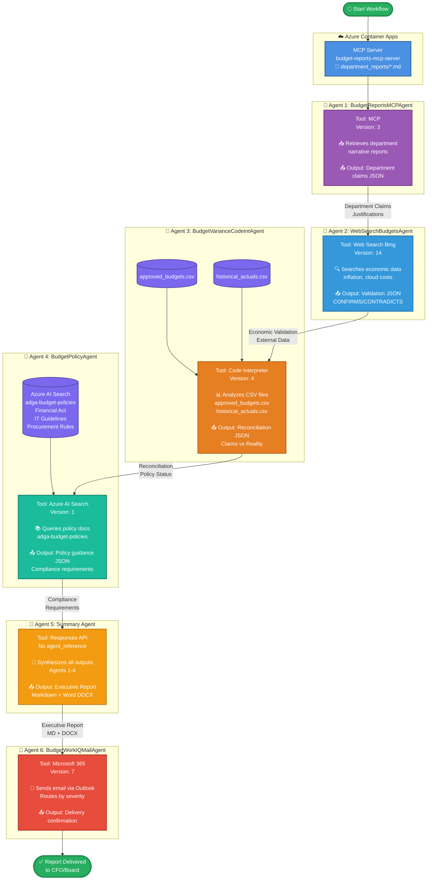

# Microsoft Agent Framework Budget Variance Analysis Sequential Agent Workflow

> **A reusable multi-agent workflow framework** built with Microsoft Foundry Agent Service that demonstrates how to orchestrate specialized agents with different tools to solve complex business problems. This prototype showcases budget variance analysis for government agencies, but the **sequential agent pattern is designed to be adapted for any domain or use case**.
>
> **🛠️ Demonstrates Integration of 5 Key Agent Tools:**
> - **Custom MCP Server** - Serve domain-specific data from any source
> - **Code Interpreter** - Analyze structured data (CSV, Excel, databases)
> - **Foundry IQ (Azure AI Search)** - Retrieve policy, compliance, or knowledge documents
> - **Work IQ (Microsoft 365)** - Automate email, calendar, Teams notifications
> - **Web Search (Bing)** - Gather real-time external context and validation
>
> **🎯 Perfect for building your own workflows:** Mix and match these tools to create agents tailored to your specific business requirements—whether it's compliance auditing, financial reporting, customer service automation, or operational intelligence.

---

## 🎯 Overview

This workflow demonstrates a **public finance use case**: automating quarterly budget variance analysis for the **Apex Digital Government Authority (ADGA)** (Fake company name) using a 6-agent sequential pipeline.

### What It Does

**The workflow performs 3-way reconciliation:**
1. **Department Claims** (what departments SAY happened) → via MCP server
2. **Economic Validation** (external data confirms/contradicts) → via Web Search
3. **Official Data** (what ACTUALLY happened) → via CSV file analysis
4. **Policy Compliance** (what regulations REQUIRE) → via AI Search

**Output:** A comprehensive executive report (Markdown + Word) delivered via Outlook and a Generated word document. 

### Key Features

✅ **Model Context Protocol (MCP)** - Custom server deployed to Azure Container Apps  
✅ **Web Search Integration** - Real-time economic data validation  
✅ **Code Interpreter** - Python-based CSV analysis with file attachments  
✅ **Foundry IQ (AI Search)** - RAG over policy documents  
✅ **Microsoft 365** - Automated email delivery via Outlook  
✅ **Sequential Agent Orchestration** - Each agent builds on previous outputs  
✅ **Enterprise-Ready** - Handles real CSV data, generates audit-ready reports

---

## 🏗️ Architecture

### High-Level Flow

```
┌─────────────────────────────────────────────────────────────────────┐
│                    BUDGET VARIANCE WORKFLOW                         │
│                  (6 Sequential Agents + MCP Server)                 │
└─────────────────────────────────────────────────────────────────────┘

┌──────────────────────────────────────────────────────────────────────┐
│  📦 Azure Container Apps                                             │
│  ┌────────────────────────────────────────────────────────────────┐ │
│  │  MCP Server: budget-reports-mcp-server                         │ │
│  │  Serves: department_reports/*.md (narratives & justifications) │ │
│  └────────────────────────────────────────────────────────────────┘ │
└──────────────────────────────────────────────────────────────────────┘
                                  │
                                  ▼
┌─────────────────────────────────────────────────────────────────────┐
│  AGENT 1: BudgetReportsMCPAgent                                     │
│  Tool: MCP                                                          │
│  Output: Department claims & justifications (JSON)                 │
└─────────────────────────────────────────────────────────────────────┘
                                  │
                                  ▼
┌─────────────────────────────────────────────────────────────────────┐
│  AGENT 2: WebSearchBudgetsAgent                                     │
│  Tool: Web Search (Bing Grounding)                                  │
│  Output: Economic validation data (inflation, cloud costs, etc.)   │
└─────────────────────────────────────────────────────────────────────┘
                                  │
                                  ▼
┌─────────────────────────────────────────────────────────────────────┐
│  AGENT 3: BudgetVarianceCodeIntAgent                                │
│  Tool: Code Interpreter                                             │
│  Files: approved_budgets.csv, historical_actuals.csv                │
│  Output: Reconciliation analysis (claims vs. reality) + policy check│
└─────────────────────────────────────────────────────────────────────┘
                                  │
                                  ▼
┌─────────────────────────────────────────────────────────────────────┐
│  AGENT 4: BudgetPolicyAgent                                         │
│  Tool: Azure AI Search (Foundry IQ)                                 │
│  Index: adga-budget-policies                                        │
│  Output: Compliance requirements, regulatory risks, timelines       │
└─────────────────────────────────────────────────────────────────────┘
                                  │
                                  ▼
┌─────────────────────────────────────────────────────────────────────┐
│  AGENT 5: Summary Agent                                             │
│  Tool: Responses API (no agent_reference)                           │
│  Output: Executive Markdown report → Word document                  │
└─────────────────────────────────────────────────────────────────────┘
                                  │
                                  ▼
┌─────────────────────────────────────────────────────────────────────┐
│  AGENT 6: BudgetWorkIQMailAgent                                     │
│  Tool: Microsoft 365 (Outlook)                                      │
│  Output: Email sent to CFO/Board with report attached               │
└─────────────────────────────────────────────────────────────────────┘
```

### Interactive Architecture Diagram



---

## 🤖 The 6 Agents

### Agent 1: **BudgetReportsMCPAgent**
**Foundry Agent Name:** `BudgetReportsMCPAgent` (version 3)
**Tool:** Model Context Protocol (MCP)
**MCP Endpoint:** Azure Container Apps deployment

**Purpose:** Retrieves department-submitted narrative variance reports containing justifications, claims, and remediation plans.

**What it retrieves:**
- Department variance narratives (Markdown format)
- Claimed actual spend vs. approved budget
- Justifications (e.g., "Zero Trust mandate", "cloud cost inflation")
- External factors cited (weather, mandates, incidents)
- Proposed remediation actions

**Output Format:** JSON with department claims, justifications, and metadata

**Key Concept:** This represents **what departments CLAIM happened** (not yet verified).

---

### Agent 2: **WebSearchBudgetsAgent**
**Foundry Agent Name:** `WebSearchBudgetsAgent` (version 14)
**Tool:** Web Search (Bing Grounding)

**Purpose:** Validates department claims against real-world economic data.

**What it searches for:**
- UAE inflation rates (Q1 2026)
- Cloud computing cost trends
- Energy price changes
- Cybersecurity incidents in public sector
- Government procurement regulation updates
- HR recruitment market conditions

**Output Format:** JSON with sector trends and claim validation (CONFIRMED/CONTRADICTS/UNCLEAR)

**Example Validation:**
```json
{
  "cloud_computing": {
    "cost_trend": "increasing",
    "yoy_change_pct": 12,
    "validation": "CONFIRMS department claim about +12% cloud inflation"
  }
}
```

---

### Agent 3: **BudgetVarianceCodeIntAgent**
**Foundry Agent Name:** `BudgetVarianceCodeIntAgent` (version 4)
**Tool:** Code Interpreter
**Attached Files:**
- `approved_budgets.csv` (official approved budgets)
- `historical_actuals.csv` (official spending data)

**Purpose:** Analyzes official CSV data to determine **what ACTUALLY happened** and reconciles against department claims.

**What it does:**
1. Loads CSV files using Python (pandas)
2. Calculates actual variances from official data
3. Compares department claims vs. actual figures (discrepancy detection)
4. Applies policy thresholds:
   - ✅ ACCEPTABLE: <5%
   - ⚠️ MINOR: 5-10%
   - 🔶 SIGNIFICANT: 10-25% (requires CFO approval)
   - 🚨 CRITICAL: >25% (requires Board notification)
5. Assesses credibility of justifications using Agent 2's economic data
6. Analyzes historical trends (4-quarter comparison)

**Output Format:** JSON with reconciliation findings, policy status, credibility assessment

**Key Feature:** 3-way reconciliation (claims vs. reality vs. economic context)

---

### Agent 4: **BudgetPolicyAgent** 
**Foundry Agent Name:** `BudgetPolicyAgent` (version 1)
**Tool:** Azure AI Search (Foundry IQ)
**AI Search Index:** `adga-budget-policies`

**Purpose:** Retrieves authoritative policy guidance from ingested regulatory documents.

**Documents Searched:**
- ADGA Financial Management Act 2024
- IT Technology Spending Guidelines 2026
- Public Sector Procurement Guidelines 2026

**What it provides:**
- Specific policy section citations (e.g., "Section 6.3 - Critical Variance Procedures")
- Escalation requirements and timelines
- Approval authorities (CFO vs. Board)
- Sector-specific guidance (IT has modified thresholds)
- Compliance risks and audit implications

**Output Format:** JSON with policy requirements, mandatory actions, timelines

**Example Output:**
```json
{
  "department_code": "IT",
  "variance_pct": 28.4,
  "policy_requirements": {
    "escalation_required": "Board notification within 15 business days",
    "approval_authority": "Board of Directors"
  }
}
```

---

### Agent 5: **Summary Agent** (Not a Foundry Agent type)
**Type:** Responses API (inline agent, not `agent_reference`)
**Tool:** GPT-5-mini via Responses API

**Purpose:** Synthesizes all previous agent outputs into a comprehensive executive report.

**Inputs:**
1. Department claims (Agent 1)
2. Economic validation (Agent 2)
3. Official variance analysis (Agent 3)
4. Policy guidance (Agent 4)

**Outputs:**
1. **Markdown report** with:
   - Executive summary
   - Department-by-department analysis
   - Compliance timeline table
   - Recommendations with rationale
   - Historical trend analysis
2. **Word document (.docx)** for stakeholder distribution

**Report Structure:**
- 📊 Executive Summary
- 💰 Overall Budget Position
- 📋 Department Variance Summary (table)
- 🌍 Economic Context & Claim Validation
- 🔍 Detailed Department Analysis (CRITICAL/SIGNIFICANT only)
- ⚠️ Required Actions & Compliance Timeline
- 💡 Recommendations
- ✅ Audit Trail

---

### Agent 6: **BudgetWorkIQMailAgent**
**Foundry Agent Name:** `BudgetWorkIQMailAgent` (version 7)
**Tool:** Microsoft 365 (Outlook via Microsoft Graph API)

**Purpose:** Distributes the final report to appropriate stakeholders via email.

**Email Routing Logic:**
- **CRITICAL variance** (>25%) → CFO + Board Secretary + Internal Audit
- **SIGNIFICANT variance** (10-25%) → CFO + Finance Director
- **MINOR/ACCEPTABLE** → Finance Director + Budget Manager

**Email Components:**
- Subject line with severity indicator
- Professional body with key highlights
- Attached report (Markdown + Word)
- Importance flag based on severity

**Output Format:** JSON with delivery confirmation, recipients, message ID

---

## 📦 Prerequisites

### Required Azure Resources

1. **Azure AI Foundry Hub + Project**
   - Enable Agent Service
   - GPT-4.1, gpt-5-mini, gpt-5, gpt-5.4 etc.. deployment

2. **Azure Container Registry** (for MCP server)

3. **Azure Container Apps** (for MCP server hosting)

4. **Azure AI Search** (for Foundry IQ / Agent 4)
   - Create index: `adga-budget-policies`
   - Ingest policy documents from `data/foundry_iq_docs/`

5. **Microsoft 365** (for Outlook integration)
   - Outlook connection configured in Agent Service

---

## 🚀 Deployment Guide

### Step 1: Deploy MCP Server to Azure Container Apps

The MCP server provides department narrative reports to Agent 1.

```powershell

# Deploy to Azure (creates resource group, ACR, Container App)
.\deploy-to-aca.ps1
```

**What this does:**
1. Creates Azure Resource Group
2. Creates Azure Container Registry (ACR)
3. Builds Docker image with `budget-reports-mcp-server.py`
4. Pushes image to ACR
5. Creates Container App Environment
6. Deploys Container App with public endpoint

**Expected Output:**
```
✅ Deployment successful!

MCP Server Endpoint:
https://budget-reports-mcp-server.<random-id>.eastus.azurecontainerapps.io/mcp
```

**Save this URL** - you'll need it for Agent 1 configuration.

---

### Step 1.2: Test MCP Server Endpoint

Verify the MCP server is working:

```powershell
# Test the MCP endpoint
.\test-mcp-endpoint.ps1
```

Or use curl:
```bash
curl https://budget-reports-mcp-server.<your-id>.eastus.azurecontainerapps.io/sse
```

You should see: `event: endpoint` response with MCP protocol information.


---
### Step 1.3: Create MCP Server Agent (Agent 1)
Agent 4 requires a custom MCP Server tool. Use the Remote MCP Server and copy it to the agent tool. 

---


### Step 2: Create Foundry IQ Index (Agent 4)

Agent 4 requires an Azure AI Search index with policy documents.

#### 2.1 Create AI Search Index

Run notebook `data/department_reports/create_foundryiq_search_index.ipynb` to create index `budget-reports-workflow-index`

THe notebook ingests these files from `data/foundry_iq_docs/`:
- `ADGA_Financial_Management_Act_2024.md`
- `IT_Technology_Spending_Guidelines_2026.md`
- `Public_Sector_Procurement_Guidelines_2026.md`

---

### Step 3: Create Agents in Azure AI Foundry

Create **5 agents** in the Azure AI Foundry portal with these exact names and configurations:

#### Agent 1: BudgetReportsMCPAgent

```
Name: BudgetReportsMCPAgent
Version: 3
Model: gpt-5-mini (or your deployment)
Tools: ✅ mcp

MCP Configuration:
  Endpoint: https://budget-reports-mcp-server.<your-id>.eastus.azurecontainerapps.io/mcp

Instructions:
  Copy entire content from: prompts/agent1_mcp_data.txt
```

#### Agent 2: WebSearchBudgetsAgent

```
Name: WebSearchBudgetsAgent
Version: 14
Model: gpt-5-mini
Tools: ✅ bing_grounding

Instructions:
  Copy entire content from: prompts/agent2_web_search.txt
```

#### Agent 3: BudgetVarianceCodeIntAgent

```
Name: BudgetVarianceCodeIntAgent
Version: 4
Model: gpt-5
Tools: ✅ code_interpreter

File Attachments:
  ✅ Upload: data/approved_budgets.csv
  ✅ Upload: data/historical_actuals.csv

Instructions:
  Copy entire content from: prompts/agent3_code_interpreter.txt
```

**IMPORTANT:** The CSV files must be uploaded as **attachments** to the agent in the Foundry portal. The agent will automatically have access to these files when running code.

#### Agent 4: BudgetPolicyAgent

```
Create index using the notebook: data/department_reports/create_foundryiq_search_index.ipynb

Name: BudgetPolicyAgent
Version: 1
Model: gpt-5-mini
Tools: ✅ Foundry IQ Knowledgebase 
OR ✅ Azure AI Search as a Foundry tool 

AI Search Configuration:
  Index name: budget-reports-workflow-index 

Instructions:
  Copy entire content from: prompts/agent4_foundry_iq.txt
```

#### Agent 6: BudgetWorkIQMailAgent

```
Name: BudgetWorkIQMailAgent
Version: 7
Model: gpt-5-mini
Tools: ✅ microsoft365 (Outlook connection)

Instructions:
  Copy entire content from: prompts/agent6_outlook.txt
```

---

## ▶️ Running the Workflow

Step 1: Create a `.env` file in the directory:

**Update these values:**
- `AZURE_AI_PROJECT_ENDPOINT` - Your Azure AI Foundry project endpoint
- `MCP_SERVER_URL` - From Step 1 deployment output
- `OUTLOOK_RECIPIENT_EMAIL` - Your email address
- Agent versions - Match what you created in Step 4

Step 2: 
```powershell
# Activate virtual environment (if using one)
uv venv venv 
venv\Scripts\activate

# Log in to Azure 
Azd auth login 

# Install required packages
Uv pip install agent-framework --pre
uv pip install -r requirements.txt

# Run the workflow
python budget_variance_workflow.py
```
---


### Expected Console Output

```
=================================================================
  BUDGET VARIANCE WORKFLOW — START (6 AGENTS)
=================================================================

[Agent 1] MCP Data Agent — calling BudgetReportsMCPAgent v3...
[Agent 1] Retrieving department-submitted narrative reports...
[Agent 1] Done. Retrieved department narratives.
...

[Agent 2] Web Search Agent — calling WebSearchBudgetsAgent v14...
[Agent 2] Searching for economic validation data...
[Agent 2] Done. Retrieved economic context.
...

[Agent 3] Code Interpreter Agent — calling BudgetVarianceCodeIntAgent v4...
[Agent 3] Analyzing official CSV files and reconciling against claims...
[Agent 3] Done. Completed reconciliation analysis.
...

[Agent 4] Foundry IQ Policy Agent — calling BudgetPolicyAgent v1...
[Agent 4] Querying Azure AI Search for policy guidance...
[Agent 4] Done. Retrieved policy guidance.
...

[Agent 5] Summary Agent — synthesizing all outputs...
[Agent 5] Generating executive Markdown report...
[Agent 5] Converting to Word document...
[Agent 5] Done. Report saved to output_examples/budget_variance_report_*.md

[Agent 6] Outlook Mail Agent — calling BudgetWorkIQMailAgent v7...
[Agent 6] Sending email to your-email@example.com...
[Agent 6] Done. Email sent successfully.

=================================================================
  WORKFLOW COMPLETE
=================================================================
Results saved to: output_examples/
```

### Execution Time

Typical runtime: **2-4 minutes** (depends on agent response times)

---

### Sample Report Structure

The generated report includes:

1. **Executive Summary**
   - Overall variance position (total AED and %)
   - Number of CRITICAL/SIGNIFICANT departments
   - Key compliance issues
   - Top recommendations

2. **Department Variance Table**
   ```
   | Dept | Name | Approved | Actual | Variance | % | Status |
   |------|------|----------|--------|----------|---|--------|
   | IT   | ... | 4.2M     | 4.39M  | +190K    |+4.5%| ✅ OK |
   | FIN  | ... | 1.75M    | 1.95M  | +200K    |+11%| 🔶 SIG |
   ```

3. **Economic Context**
   - Validation of department claims (from Agent 2)
   - Sector trends (cloud costs, inflation, etc.)

4. **Detailed Analysis** (for SIGNIFICANT/CRITICAL departments)
   - Department claims vs. official data
   - Credibility assessment
   - Policy compliance status
   - Required actions with deadlines

5. **Recommendations**
   - Approve/reject with rationale
   - Remediation conditions
   - Future planning guidance

**View the full example:** [`output_examples/budget_variance_report_20260330_161539.md`](output_examples/budget_variance_report_20260330_161539.md)

---

## 📁 Project Structure

```
digital_transformation_demo/
├── README.md                          # This file
├── budget_variance_workflow.py        # Main orchestration script
├── budget-reports-mcp-server.py       # MCP server (deployed to ACA)
├── Dockerfile                         # Container image for MCP server
├── requirements.txt                   # Python dependencies
├── .env                               # Environment variables (create this)
│
├── deploy-to-aca.ps1                  # Azure Container Apps deployment
├── test-mcp-endpoint.ps1              # MCP server testing script
├── preflight-check.ps1                # Pre-deployment validation
│
├── data/                              # Input data files
│   ├── approved_budgets.csv           # Official approved budgets
│   ├── historical_actuals.csv         # Official spending data
│   ├── department_metadata.json       # Department reference data
│   ├── variance_policy.json           # Policy thresholds
│   │
│   ├── department_reports/            # Department narrative reports
│   │   ├── IT_Q1_2026_variance_report.md
│   │   ├── HR_Q1_2026_variance_report.md
│   │   └── INF_Q1_2026_variance_report.md
│   │
│   └── foundry_iq_docs/               # Policy documents for AI Search
│       ├── ADGA_Financial_Management_Act_2024.md
│       ├── IT_Technology_Spending_Guidelines_2026.md
│       └── Public_Sector_Procurement_Guidelines_2026.md
│
├── prompts/                           # Agent instructions
│   ├── agent1_mcp_data.txt
│   ├── agent2_web_search.txt
│   ├── agent3_code_interpreter.txt
│   ├── agent4_foundry_iq.txt
│   ├── agent5_summary.txt
│   └── agent6_outlook.txt
│
└── output_examples/                   # Sample workflow outputs
    ├── budget_variance_report_20260330_161539.md
    └── budget_variance_report_20260330_161539.docx
```
